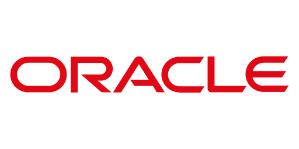

# Workshop — Kickstart Your AI Journey with LangChain4j
<h2 color="#89B2B0">Buil AI-infused Java Applications with LangChain4j</h2> 

  

**Persenter:**   Elvadas Nono
**Format:**  Presenation, Hands one Labs & Demos
**Audience:**  Developers, Architects, DevOps, Platform Engineers

--- 
# Workshop outcomes for Participants

By the end, attendees will:
- Understand what is LangChain4j and its positionning in LLM/AI landscape.
- Build Modern AI Java applicaiton with LangChain4j framework 
- Implement RAG pipelines,Agent and Tooling with LangChain4j
- Build Hands one apps with LangChain4j and Ollama
---

# Agenda
- Welcome and context : Why LangChain4j ?
- Introduction to LangChain4j - core concepts
  - LLM, Prompt,Tokens, Contect Windows
  - Chat, Images, Audio,Embedding, Moderation
- Memory Management
- Chains 
- RAG Pipelines
- Tools & Function Calling
- Agents 
- Q&A

---